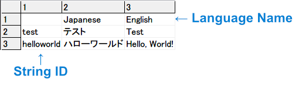
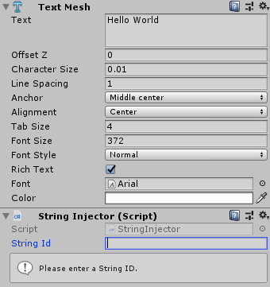

# Localizer

Localizer for Unity

This library intends to use at small Unity project that needs to be localized to multiple languages.

## Features

- Automatically inject strings to TextMesh, TextMeshPro, Text(UI) component.
- Simple API
- Load multi-language definition file. (TSV)
- Editor preview and useful warnings.

## How to Use

### Preparation

1. Make UTF-8 TSV.

   

2. Place it to streaming assets.

### Automatic Injection

Add **String Injector** next to the text component and enter String ID.



Supported component:

- TextMesh
- Text (UI)
- TextMeshPro
- TextMeshProUGUI

### Get String from Code

```csharp
var text = Localizer.GetStringFromId("helloworld"); // ex. Hello, World!
var jpText = Localizer.GetStringFromId("helloworld", "Japanese"); // ex. ハローワールド
```

### Change Language

```csharp
Localizer.ChangeLanguage("Japanese");
```

## Roadmap

- Image Injection
- AudioClip Injection

## License

[MIT License](LICENSE)