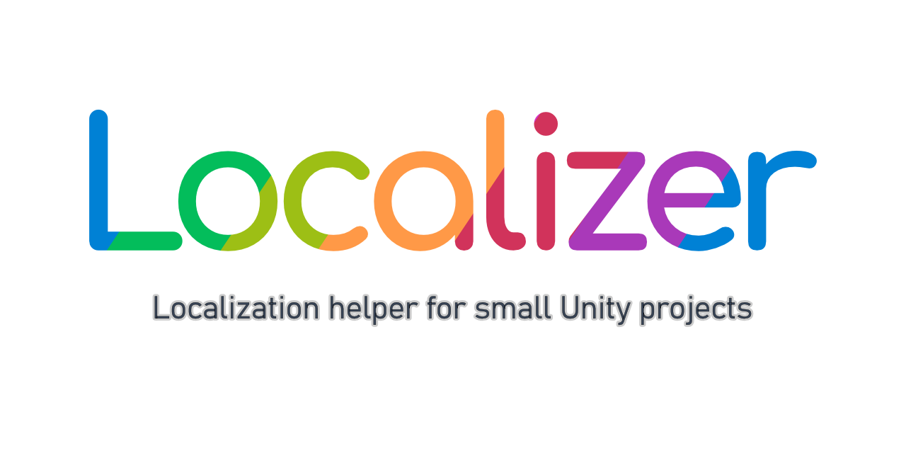
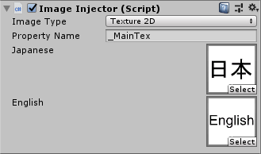
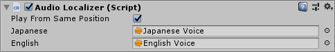

<h1 align="center">
  
</h1>

This library intends to use at small Unity project that needs to be localized to multiple languages.

[**Download From Here**](https://github.com/yutokun/Localizer/releases) or if you would like, buy it at Asset Store! (currently in review)

## Features

- Automatically inject strings to text-type component.
- Automatically inject images to image-type component.
- Simple API
- Load multi-language definition file. (TSV)
- Editor preview and useful warnings.

## How to Use

### Preparation

1. Make UTF-8 TSV.

   

2. Place it to StreamingAssets folder with the name "**LocalizedStrings.tsv**".

### Automatic String Injection

Add **String Localizer** next to the supported component and enter String ID. It suggest candidate IDs as you type.

Localized strings will be injected when the component starts.


Supported component:

- TextMesh
- Text (UI)
- TextMeshPro
- TextMeshProUGUI

### Automatic Image Injection

Add **Image Localizer** next to the supported component and set images.

Localized images will be injected when the component starts.



Supported component:

- Renderer
- Image
- RawImage

### Automatic Audio Injection

Add **Audio Localizer** next to the supported component and set AudioClips.

Localized audio will be injected when the components starts.



Supported component:

- AudioSource

### Get String from Code

```csharp
var text = Localizer.GetStringFromId("helloworld"); // ex. Hello, World!
var jpText = Localizer.GetStringFromId("helloworld", "Japanese"); // ex. ハローワールド
```

### Change Language

```csharp
Localizer.ActivateNextLanguage(); // easiest way
Localizer.ActivatePreviousLanguage();
Localizer.ChangeLanguage("Japanese");
```

### Get Available Language List

```csharp
Localizer.LanguageList; // returns List<string>
```

### Get Current Language Name

```csharp
Localizer.CurrentLanguageName; // returns string
```

### Reload Strings from Disk

```csharp
Localizer.Load();
```

### Force Inject to All IInjectors

```csharp
Localizer.InjectAll();
```

## License

[MIT License](LICENSE)